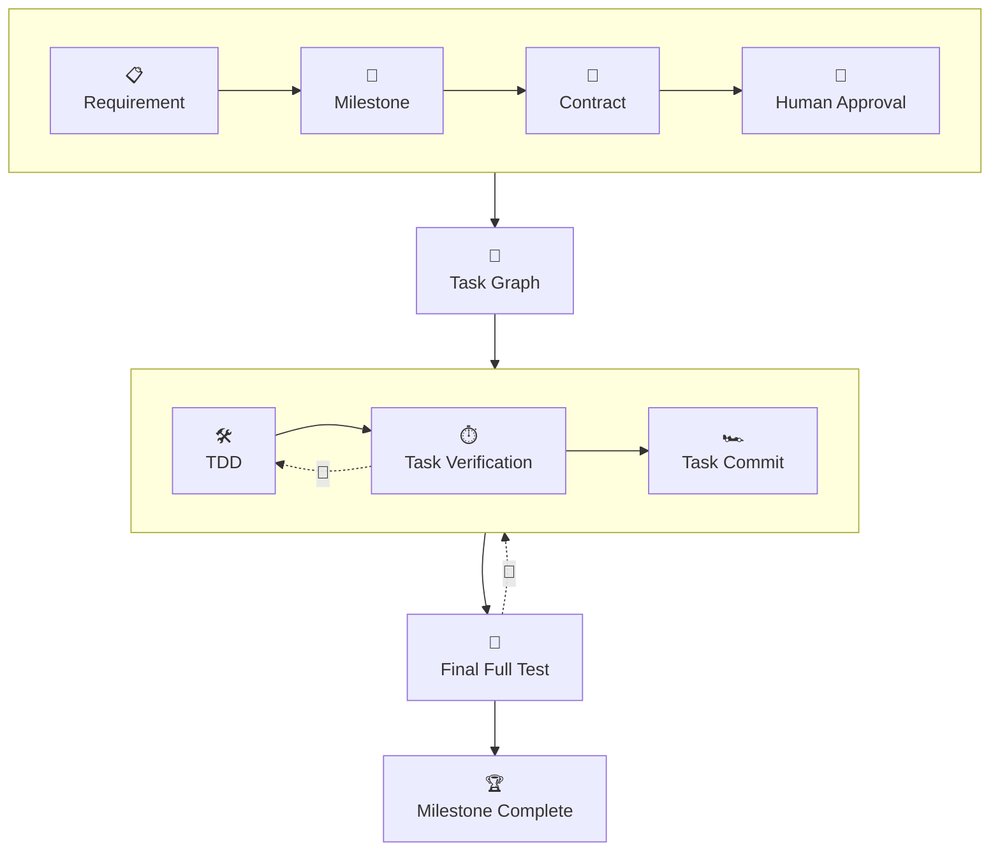

# PitWay

> **The pit crew for agentic coding.**  
> A controlled workflow for agentic software development.

[](https://www.npmjs.com/package/pitway)
[](./LICENSE)

PitWay is an npm-distributed CLI that controls the engineering process around AI coding agents — **it is not itself an agent**.

- **Agents** drive the interaction
- **PitWay** controls workflow state, engineering boundaries, verification, and traceability

> 💡 **Driver Support:** Claude Code is the first supported driver integration, while PitWay's Core remains provider-agnostic.

---

## How It Works



**Workflow Lifecycle:**

`Requirement` → `Milestone` → `Contract` → `Human Approval` → `Task Graph` → [`TDD` ⇄ `Task Verification` → `Task Commit`]* → `Final Full Test` → `Milestone Complete`

- **Workflow Enforcement:** Validates state transitions and enforces task write boundaries.
- **Two-Tier Verification:** Runs targeted verification for each task, followed by a mandatory full test suite before closing the milestone.
- **Durable State:** Creates traceable Git checkpoints without relying on transient AI conversation memory.

---

## Quickstart

### 1. Install & Initialize

Run once from the root of a Git repository (run `git init` first if needed):

```bash
npm install -g pitway

pitway init
```

- PitWay initializes `.pitway/` and installs the Claude Code integration by default.
- Use `pitway init --no-claude` to opt out of the Claude Code integration.

### 2. Resume Workflow

Inspect or continue the current workflow at any time:

```bash
pitway resume
```

> 📌 **Commit Traceability:** Before implementation begins, the developer reviews and confirms the milestone contract. Task commits carry `PitWay-Milestone` and `PitWay-Task` Git trailers; milestone baseline and completion commits carry the milestone trailer.

### 3. Explore Commands

Run the following for the full, authoritative CLI command surface and available flags:

```bash
pitway --help
```

---

## Commands & Integration

- **Command Reference:** Run `pitway --help` for the full, authoritative CLI command surface and available flags.
- **Claude Code:** For Claude Code projects, the installed `.claude/` assets document how the driver interacts with PitWay.

---

## Engineering Boundaries

| Boundary Property | Behavior & Scope |
| --- | --- |
| `write_scope` | **Mechanically enforced** task boundary to prevent unintended file modifications. |
| `context_files` | Limits task-context bundles supplied by PitWay *(not an OS-level read sandbox)*. |
| **Agent Runtime** | PitWay does **not** claim control over external agent runtimes, shells, or OS tool permissions. |

---

## Dogfooding & Verification

PitWay is developed and maintained using its own workflow:

- **M001–M003:** Bootstrap foundation
- **M004:** Crossed the self-hosting boundary
- **M005+:** Created, verified, and completed entirely through PitWay

All project claims are bounded strictly by evidence that survives a fresh clone: committed Git history, `.pitway/` state, and the automated test suite.

---

> **There is a way to build with agents. This is PitWay.**

## License

MIT — see [LICENSE](./LICENSE).
